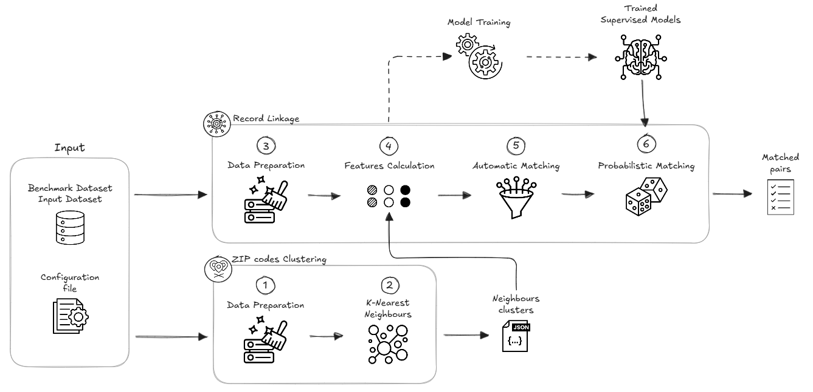

# HEINEKEN UK: Sigle View of Customer

The Single View of Customer (**SVOC**) is a record linkage project that aims to match the records regarding the Beavertown on-trade clients from two different data sources.

Each dataset contains the following fields about the outlets:

- ID;
- name;
- address;
- postal code;
- postal code latitude;
- postal code longitude.

The developed algorithm matches each record from the benchmark dataset to N record of the input dataset, computing several similarity scores to compare the outlet name, address and postal code. 
The expected output is a dataframe containing the pairs of matched records and several information about the type of match. The objective is to provide Beavertown N matches for each record from the benchmark dataset so that they can manually choose the most appropriate one.

## Repository Structure

├── config/ &nbsp;&nbsp;&nbsp;&nbsp;&nbsp;&nbsp;&nbsp;&nbsp;&nbsp;&nbsp;&nbsp;&nbsp;&nbsp;&nbsp;&nbsp;&nbsp;&nbsp;&nbsp;&nbsp;&nbsp;&nbsp;&nbsp;&nbsp;&nbsp;&nbsp;&nbsp;&nbsp;&nbsp;&nbsp;&nbsp;&nbsp;&nbsp; # Configuration files  
├── doc/ &nbsp;&nbsp;&nbsp;&nbsp;&nbsp;&nbsp;&nbsp;&nbsp;&nbsp;&nbsp;&nbsp;&nbsp;&nbsp;&nbsp;&nbsp;&nbsp;&nbsp;&nbsp;&nbsp;&nbsp;&nbsp;&nbsp;&nbsp;&nbsp;&nbsp;&nbsp;&nbsp;&nbsp;&nbsp;&nbsp;&nbsp;&nbsp;&nbsp;&nbsp;&nbsp;&nbsp; # Documentation  
├── models/&nbsp;&nbsp;&nbsp;&nbsp;&nbsp;&nbsp;&nbsp;&nbsp;&nbsp;&nbsp;&nbsp;&nbsp;&nbsp;&nbsp;&nbsp;&nbsp;&nbsp;&nbsp;&nbsp;&nbsp;&nbsp;&nbsp;&nbsp;&nbsp;&nbsp;&nbsp;&nbsp;&nbsp;&nbsp;&nbsp;&nbsp; # Trained models  
├── script/&nbsp;&nbsp;&nbsp;&nbsp;&nbsp;&nbsp;&nbsp;&nbsp;&nbsp;&nbsp;&nbsp;&nbsp;&nbsp;&nbsp;&nbsp;&nbsp;&nbsp;&nbsp;&nbsp;&nbsp;&nbsp;&nbsp;&nbsp;&nbsp;&nbsp;&nbsp;&nbsp;&nbsp;&nbsp;&nbsp;&nbsp;&nbsp;&nbsp;&nbsp; # Dev script and main   
├── svoc/&nbsp;&nbsp;&nbsp;&nbsp;&nbsp;&nbsp;&nbsp;&nbsp;&nbsp;&nbsp;&nbsp;&nbsp;&nbsp;&nbsp;&nbsp;&nbsp;&nbsp;&nbsp;&nbsp;&nbsp;&nbsp;&nbsp;&nbsp;&nbsp;&nbsp;&nbsp;&nbsp;&nbsp;&nbsp;&nbsp;&nbsp;&nbsp;&nbsp;&nbsp;&nbsp;&nbsp;&nbsp;# Functions  
├── .env &nbsp;&nbsp;&nbsp;&nbsp;&nbsp;&nbsp;&nbsp;&nbsp;&nbsp;&nbsp;&nbsp;&nbsp;&nbsp;&nbsp;&nbsp;&nbsp;&nbsp;&nbsp;&nbsp;&nbsp;&nbsp;&nbsp;&nbsp;&nbsp;&nbsp;&nbsp;&nbsp;&nbsp;&nbsp;&nbsp;&nbsp;&nbsp;&nbsp;&nbsp;&nbsp;&nbsp;&nbsp;&nbsp;# Environment variables   
├── requirements.txt&nbsp;&nbsp;&nbsp;&nbsp;&nbsp;&nbsp;&nbsp;&nbsp;&nbsp;&nbsp;&nbsp;&nbsp;&nbsp;&nbsp;&nbsp;&nbsp;&nbsp;&nbsp;&nbsp;&nbsp;# Requirements   
├── requirements_runtime.txt&nbsp;&nbsp;&nbsp;&nbsp;&nbsp; # Databricks requirements   
└── README.md

## Methodology

The workflow comprehends the following main steps:

1. **K-NN Clustering**. 
To prevent the comparison between all the possible pairs of records from the benchmark and the input dataset, K-NN has been used to group the neighbouring postal codes. This step reduces the search space so that only the records within the same cluster are compared. The clusters can be saved into a $\texttt{.json}$ file and re-used.
2. **Features Calculation**. Several similarity features are calculated for the outlet name, address and postal code fields of all the pairs of records whose postal code is within the same cluster. The higher the similarity feature, the most two fields are similar. 
3. **Automatic Matching**. The record are matched through the application of several filters on the features. 
4. **Probabilistic Matching**. Three different supervised model are used to predict further matches among those records for the whom the automatic matching did not find N matches. The models can be trained using the ./script/01_training.py script, and saved into the $\texttt{./models/}$ folder.

For further information see $\texttt{./doc/doc.ipynb}$.

